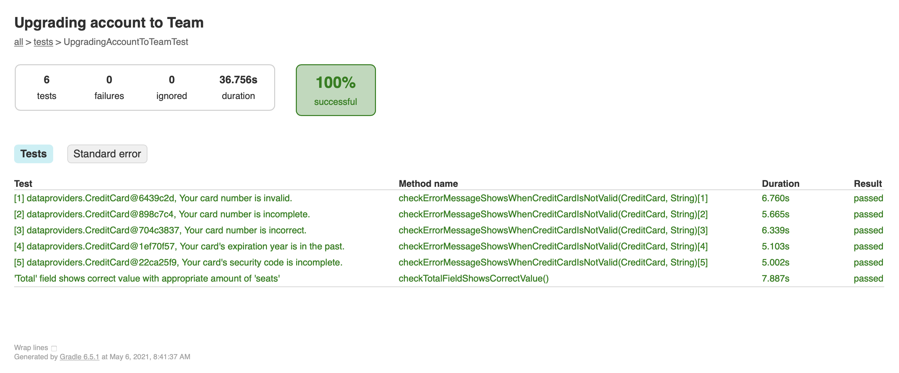

# UpgradeAccount

The project contains UI tests for upgrading free account to a team

## How to run tests with gradle:
1. [Install gradle](https://gradle.org/install/) and the latest java
2. Clone the project
5. Go to the project folder
6. Create the file `gradle.properties`
7. Add BASE_URL, USER_NAME and PASSWORD there, e.g.

    `BASE_URL=https://miro.com/app/dashboard/` 
    
    `USER_NAME=${USER_NAME}` 
    
    `PASSWORD=${PASSWORD}` 
    
9. Run the command in terminal:

`gradle test` or `./gradlew test` (for Windows: `gradlew test`)

If you want to run Chrome not in headless mode use the following command:

`./gradlew clean test -Dheadless=false`

## How to run tests in Docker:

If you don't have Gradle and/or JDK installed on your machine you can run tests in Docker.

1. [Install Docker](https://docs.docker.com/get-docker/) on your local machine 
2. Clone the project 
3. Go to the project folder
4. Create the file `gradle.properties`
5. Add BASE_URL, USER_NAME and PASSWORD there, e.g.

    `BASE_URL=https://miro.com/app/dashboard/` 
    
    `USER_NAME=${USER_NAME}` 
    
    `PASSWORD=${PASSWORD}` 
   
6. Run the command in terminal:

Linux/Mac: 
```bash
docker run --rm \
    -v "$PWD":/home/gradle/project \
    -w /home/gradle/project leapci/gradle-chrome:jdk-11 gradle test -q
```

Windows in PowerShell: 

```powershell
docker run --rm `
    -v "$(PWD):/home/gradle/project" `
    -w /home/gradle/project leapci/gradle-chrome:jdk-11 gradle test -q
```

## View the test report

Open `index.html` in a browser to see the tests results. This file will be generated in the folder: `/UpgradeAccount/build/reports/tests/test/`

You should see the following results:



## View the test report produced by CI 

This repository contains a GitHub Actions build pipeline which is triggered on every push. It executes `gradle test` command in a docker container, and then uploads test reports as build artifacts. 

You can find and download them by navigating to https://github.com/OlgaLa/UpgradeAccount/actions and selecting the latest run log. The artifacts would be located in **Artifacts** section at the bottom of the page.

